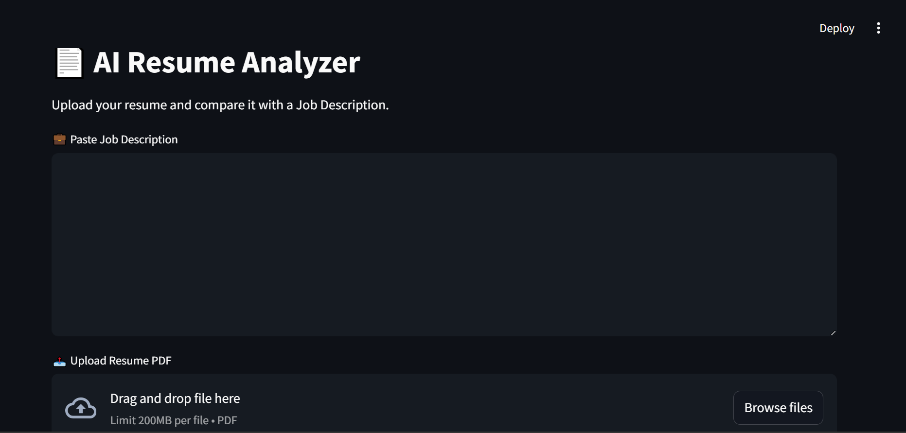
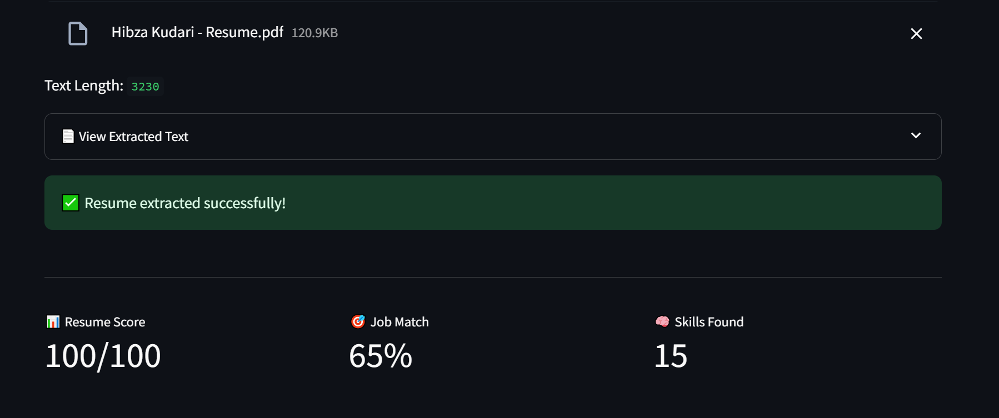
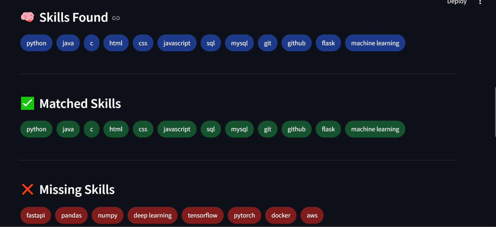
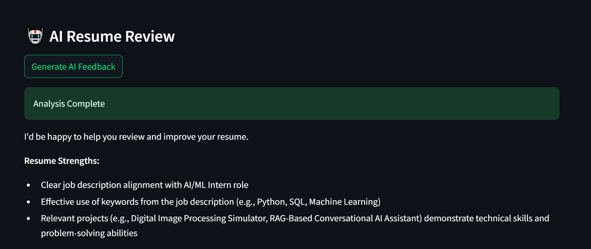

# AI Resume Analyzer

An AI-powered Resume Analyzer built with Python, Streamlit, Ollama, EasyOCR, and ATS-based skill matching.

## Features

* Upload Resume PDFs
* OCR support for scanned resumes
* Skill Extraction
* ATS Resume Scoring
* Job Description Matching
* Missing Skills Detection
* AI-Powered Resume Feedback using Ollama
* Interactive Dashboard
* Visual Skill Match Analysis

## Screenshots

### Home Page



### Resume Analysis



### Skills Detection



### AI Feedback



## Tech Stack

* Python
* Streamlit
* Ollama (Llama 3.2)
* EasyOCR
* PyMuPDF
* Plotly

## Installation

```bash
pip install -r requirements.txt
```

## Run

```bash
streamlit run app.py
```

## Project Structure

```text
app.py
ocr_helper.py
ollama_helper.py
skills.py
requirements.txt
screenshots/
```

## Future Improvements

* Interview Question Generator
* Resume Recommendations
* PDF Report Export
* Multi-Resume Comparison
* Cloud Deployment

## Author

Hibza Kudari
